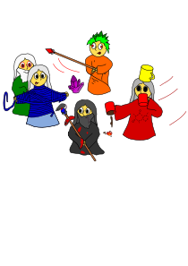

==================================
Looney Mages' Cruise - A Boardgame
==================================

*Ache Mage, Coffee Magiatto, Duct Tape Mage and Gastronomage are on their weekend cruise on their beloved ship Booty to visit their old friends at the high academy of magical arts. Suddenly, purple strings of pure magic emerge from within the fabric of space and time, dragging it into void between the six and half dimensions of reality.*

This game can be played by four players navigating one of the four playable mages who fix the wreckage caused by the jumps through the dimensions. To do so, the players have to plan each round by choosing action cards and their order.
Your objective is to survive your inter-dimensional trip to the high academy of magical arts by ensuring that no mage dies and ol' Booty stays in shape.
As each round has a time limit, total game time is about 30 min.

Main Content
============

Game Material:

- things you may have lying around:

  + 4 times D6 (only used to track health, you may use pen and paper instead)
  + one D8 and D10 (you may use an app/a program to simulate this)

- things you have to print:
  + all files from within the print directory
  + **Note**: there is a small and large version of the action cards, you can choose which you want to print

Game Flow
=========

The game is played in six rounds, each consisting of five actions per player.
Each round starts with the **Preparation Phase**, followed by the **Planning Phase** and the **Action Phase**.
The initial setup consists of:

- put the main game board -- the deck of your magical ship -- to the center of the table.
- randomly assign the starting mage token to a player
- shuffle the mage sheets (except for the Juggermage) and deal one to each player
- put the mage tokens of the four playable mages in each corner of the board
- put the Juggermage token randomly somewhere in the middle of the ship deck
- put a dice on the mage sheet hit point slot to indicate your current life (adjust difficulty, by setting the following starting hit points: starter: 6, advanced: 4, crazy wizard: 2) -- the Juggermage is immortal
- randomly put obstacle tokens (adjust the difficulty, by setting the following number of obstacles: starter: 4, advanced: 6, crazy wizard: 8) on the playfield ensuring that no mage is blocked

**Preparation Phase**:

- give the start mage token to the mage on your left (clock-wise)
- add another hazard token to all hazards not dealt with the last round
- add new hazards: use a D8 and D10 to randomly spawn the following hazards at the rolled coordinate:
  + 1 fire (red)
  + 1 hull breach (blue)
  + 1 rat plague (grey)
  + 2 corruption (purple)
- during this phase, you may chat with each other to plan your moves
- shuffle the action cards and deal ten unrevealed to each player, ten cards to a backup pile
- deal five cards to the Juggermage and reveal them -- the starting mage explains the movement path of the Juggermage to the fellow magicians

**I Planning Phase**:

- the action phase has a time limit of 1:30
- one of you may discard his hand and immediately replace it with the backup pile
- pick five actions and put them in front of you in a defined order, possible actions are:

  + movement, rotation or repair (turn one of the action cards on the back to indicate a planned repair action)
  + a repair is only possible when being adjacent to the hazard (repairing a hazard diagonally to the mage is not allowed)
  + if multiple hazards are adjacent to the mage, the mage may choose which hazard to remove (repair only one field)
  + each mage can repair a single fire, hull breach or rat token without taking damage (reducing hit points by one)
  + only the three specialized mages -- as indicated by their respective sheet and matching color -- can repair larger hazards without taking damage
  + every mage which is not specialized in dealing with fire, hull breaches or rat plagues gets one point of damage per token beyond the first one
  + each mage gets one point of damage for each removed corruption token

- you may chat with each other to optimize your turns
- if time runs out, every mage has to pick cards at random until everyone has exactly five chosen actions

**II Action Phase**:

- during the action phase the Juggermage and all other mages play their next action (as indicated by their action stack defined in the previous phase) after one another in a clock-wise fashion
- an action can either be a:

  + rotation: simply rotate the corresponding mage token
  + movement: move the mage token in the indicated direction with the displayed number of steps
  + repair: remove a hazard from an adjacent cell, thereby repairing your ship ol' Booty

- the phase ends when all mages have played all of their actions

**III Movement rules**:

- obstacles or the border of the map will stop the current movement (and will trigger a self-heal of the Ache Mage)
- when colliding with other mages, they are pushed along with the moving mage (and get healed in case of the healer)
- moving into hazards will stop the mage in front of the hazard and deal one damage to that mage
- moving on the Juggermage or getting moved by him will cause 1 HP of damage to the other mage

**Repair rules**:

- a mage can only repair the ship by removing a hazard from an adjacent field (no diagonals)
- a mage may decide during the repair action which hazard to remove if there are multiple possibilities (can only remove one)
- a repair action removes all hazard tokens from a single chosen field
- each mage can repair each type of hazards, but depending on his expertise, it might deal damage to the mage:

  + each corruption token (purple) will deal one damage per token
  + fire (red), hull breach (blue) and rat plague (grey) will deal token - 1 damage to all mages, except for the one specialized in dealing with that type of hazard
  + mages being specialized on a certain type of hazard will not take damage for that type of hazard, irrespective of the number of tokens when removing the hazard

**Win and Loose Conditions**:

You win the game if you survived the journey, that means:

- no mage died (dropping the hit points below 1)
- no hazard reached the fourth level
- there were not more than two hazard of the same type at the end of a round
- you and your ship survived six rounds

List of Game Materials
======================

- 1 ol' Bootys deck, a grid-based map of the ship deck for placing and moving tokens
- 5 different mage sheets (4 of them playable), for tracking hit points and explaining their special skills:

  + Ache Mage (green, has a healing touch, can heal mages, either by moving himself into a wall or obstacle or by moving another mage)
  + Coffee Magiatto (red, can easily distinguish fire with coffee, speed up once per round)
  + Duct Tape Mage (blue, can easily fix ruptures in the ship, slow down once per round)
  + Gastronomage (grey, can easily deal with rats, and make a rat skewer to heal himself)
  + Juggermage (orange, mad colleague, lost his mind jumping through dimensions and randomly interferes with the other mages, disturbing their actions)

- 5 mage tokens indicating the current viewing direction of each mage
- 1 starting mage token
- 8 obstacle tokens
- 4 types of hazard tokens:

  + fire (red)
  + hull breach (blue)
  + rat plague (grey)
  + corruption (purple)

- 104 action cards consisting of movement (cyan) and rotation (orange) cards - inspired by the RoboRalley movement system:

  + 2 x Move 4
  + 6 x Move 3
  + 12 x Move 2
  + 18 x Move 1
  + 6 x Backup
  + 9 x Move Left
  + 9 x Move Right
  + 18 x Rotate Left
  + 18 x Rotate Right
  + 6 x U Turn
