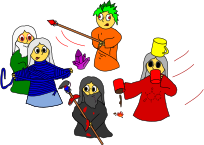

==================================
Looney Mages' Cruise - A Boardgame
==================================

Overview
========

*Ache Mage, Coffee Magiatto, Duct Tape Mage and Gastronomage are on their weekend cruise on their beloved ship Booty to visit their old friends at the high academy of magical arts. Suddenly, violet strings of pure magic emerge from within the fabric of space and time dragging it into void between the six and half dimensions of reality.*

This game can be played by four players navigating one of the four playable mages fixing the wreckage caused by the jumps through the dimensions. To do so, the have to plan each round by choosing action cards and their order for each round.
Your objective is to survive your inter-dimensional trip to the high academy of magical arts by ensuring that no mage dies and ol' Booty stays in shape.
As each round has a time limit, total game time is about 30 min.

Main Content
============

- 1 ol' Bootys deck, a grid-based map of the ship deck for placing and moving tokens
- 5 different mage sheets (4 of them playable), for tracking hit points and explaining their special skills:

  + Ache Mage (green, has a healing touch, can heal mages, either by moving himself to heal himself or by moving another mage into a wall or obstacle)
  + Coffee Magiatto (red, can easily distinguish fire with coffee, speed up)
  + Duct Tape Mage (blue, can easily fix ruptures in the ship, slow down)
  + Gastronomage (grey, can easily deal with rats, and make a rat skewer to heal himself)
  + Juggernaut (orange, mad colleague, losses his mind on taking jumps through dimensions and randomly interferes with the other mages, disturbing their actions)

- 5 mage tokens indicating the current viewing direction of each mage
- 8 obstacle tokens
- 4 types of hazards tokens:

  + fire (red)
  + hull breach (blue)
  + rat plague (grey)
  + corruption (violet)

- 104 action cards consisting of movement (cyan) and rotation (orange) cards - inspired to RoboRalley movement system:

  + 2 x Move 4
  + 6 x Move 3
  + 12 x Move 2
  + 18 x Move 1
  + 6 x Backup
  + 9 x Move Left
  + 9 x Move Right
  + 18 x Rotate Left
  + 18 x Rotate Right
  + 6 x U Turn

Game Flow
=========

The game is played in six rounds, each consisting of five actions per player.
Each round starts with the **Preparation Phase**, followed by the **Action Phase**.
The initial setup consists of:

- put the main game board -- the deck of your magical ship -- to the center of the table.
- shuffle the mage sheets and deal one to each player
- put one mage tokens in each corner of the board
- put a dice on the mage sheet hit point slot to indicate your current life (starter: 6, advanced: 4, crazy wizard: 2)
- randomly put obstacle tokens (starter: 4, advanced: 6, crazy wizard: 8) on the playfield ensuring that no mage is blocked

**Preparation Phase**:

- add another hazard token to all hazards not dealt with the last round
- use a D8 and D10 to randomly spawn the following hazards at the rolled coordinae:
  + 1 fire
  + 1 hull breach
  + 1 rat plague
  + 2 corruption
- during this phase, you may chat with each other to plan your moves
- shuffle the action cards and deal ten unrevealed to each player and one to a backup pile

**Action Phase**:

- the action phase has a time limit of 1:30
- one of you may discard his hand and replace it with the backup pile
- pick five actions and put them in front of you in a defined order, possible actions are:
  + movement, rotation or repair (turn one of the action cards on the back to indicate a repair action)
  + each mage can repair a single fire, hull breach or rat token without taking damage
  + only the three specialized mages -- as indicated by their respective sheet and matching color -- can repair larger hazards without taking damage
  + every mage which is not specialized in dealing with fire, hull breaches or rat plagues gets one point of damage per token beyond the first one
  + each mage gets one point of damage for each removed corruption token
- you may chat with each other to optimize your turns
- if time runs out, every mage has to pick cards at random until everyone has exactly five chosen actions

You win the game if you surived the yourney, that means:

- no player died (dropping the health below 1)
- no hazard reached the fourth level
- there were not more than two hazard of the same type at the end of a round
- you and your ship survied six rounds

TODO
====

- print instructions
- extra rules
